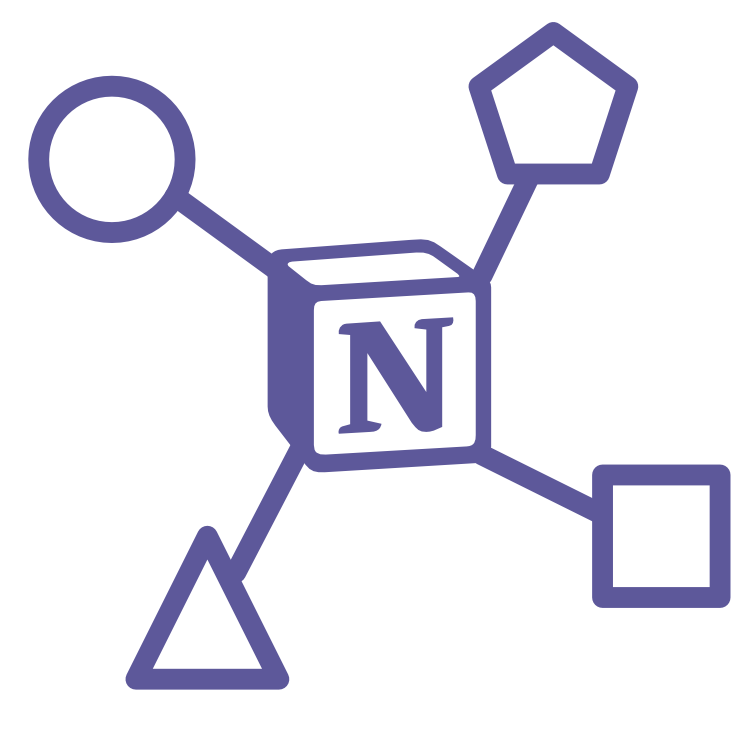

<div align="center">
    
    <h1>Notion-Integration-System</h1>
</div>

handle notion data with cli

<!-- 
On May 13, 2021 Notion released an official version of their API which makes it possible to retrieve your Notion-Data and use it in other Applications or implement features and automation-routines that are not currently supported by the editor itself.

## Concept 1 - 6.Juli 2021

### The Problem

Notion on its own is great, but certain activites like creating a proper schedule is as of now still quite laborious. Furthermore building a *second-brain* requires a lot of relations and database-entries which is a lot for notion to handle - this causes it to get noticeable slower.

### The Solution

The Notion Integration System acts like a central point between notion and other supported API's. All data is stored in a database which provides fast CRUD operations. Also in order to provide a proper second brain the system aims to make note-taking easy-to-use with the integrated CLI and a large support of file-formats.

## Version 2 - 4.Mar 2022

## Concept 2 

The notion-integration-system fetches all data from notion and stores it in a postgres database based on a self-defined model. From there you can access it by the command line and manipulate the data on it using the CLI. -->

<!-- ## Execute the Project

> I assume npm was installed correctly and it's environment-variables are set

> I also assume bash is being used

### Execute the Google Drive Project

Simply execute the following command in order to start the Webserver.

```
npm start
```

### Execute the Github Project(Production branch)

Clone the GitHub repository with `git clone`.

```
git clone https://github.com/ungarmichael/octagon-landing.git
```
```
cd octagon-landing
```

For installing all necessary dependencies run:

```
npm i
```

For creating a production-version of the project run:

```
npm run build
```

For starting the server(production version):
```
npm start
```

Now the Project can be viewed on `http://localhost:3000`.

## Further Project Details

### Design
The Mockup was created using Figma and can be viewed [here](https://www.figma.com/file/7gjL6YkZ6Yg5CegX9p9AZ9/Landing-Page?node-id=0%3A1).

Illustrations where copied from [undraw.co](https://undraw.co) and  [vecteezy.com](https://es.vecteezy.com) and manipulated according to the scenario by myself using [affinity designer](https://affinity.serif.com/en-gb/designer/), [affinity photo](https://affinity.serif.com/en-gb/photo/) and for certain use-cases [adobe illustrator](https://www.adobe.com/products/illustrator.html).


### Development

* Languages used
    * _Typescript_
    * _NodeJS_
* Frameworks used
    * _ReactJS_
    * _NextJS_
* Libraries used
    * _react-spring_
    * _react-superellipse_
    * _resize-observer-polyfill_
    * _gray-matter_
    * _remark_
    * _react-visibility-sensor_
    * other libraries can be viewed in the _/package.json_ file
* CSS-extensions
    * _Sass_ combined with
        * inline_media
* Version-control
    * _Git_
 -->

say hello -> <a href='mailto:ungarmichael.mail@gmail.com'>ungarmichael.mail@gmail.com</a>.
